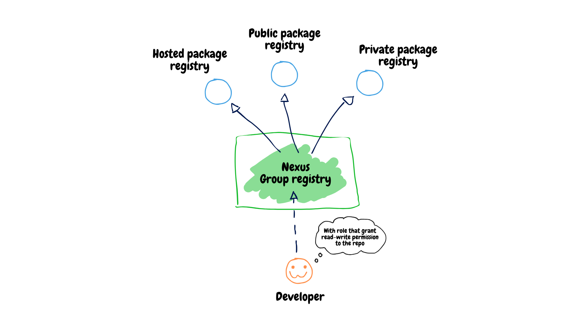

# Nexus <!-- omit from toc -->
Nexus is a single storage manager for all libs, artifacts and container images that you have in your work environment.
Just setup Nexus and save yourself from a headache where to store these endless Python/JS/C# packages and unused backup archives.

Want to know more? Read the [docs](https://help.sonatype.com/en/sonatype-nexus-repository.html).


## Table of Contents <!-- omit from toc -->
- [Deploy](#deploy)
- [Setup Repos](#setup-repos)
    - [Common config](#common-config)
    - [Npm](#npm)
        - [Auth](#auth)
        - [Access from device](#access-from-device)
    - [NuGet](#nuget)
        - [Auth](#auth-1)
        - [Access from device](#access-from-device-1)
    - [Docker](#docker)
        - [Reverse proxy](#reverse-proxy)
        - [Auth](#auth-2)
        - [Access from device](#access-from-device-2)
    - [Raw repo](#raw-repo)
        - [Auth](#auth-3)
        - [Access from device](#access-from-device-3)
- [Administration](#administration)
    - [Reset admin passowrd](#reset-admin-password)
    - [Backup](#backup)


## Deploy
You can run Nexus on server via compose file from this repo:
```sh
docker compose -f path/to/repo/compose.yaml up -d 
```

Or using Nomad's job:
```sh
nomad job run --address=http://ip:4646 --token=token path/to/repo/nomad-job.hcl
```

## Setup Repos
### Common config
These common steps required to setup a repo on Nexus instance:
- Go to server administration page -> Blob storage
- Create a blob storage for a future repo
- Switch to the "Repositories" tab and press "Create repository"
- Choose wanted type of the repo
- Follow along the configuration
- Switch to the "Realms" and activate security realm for your repo type (if any)
- Switch to the "Roles" and create role with "read-write" permissions to repo (use nx-repository-view-<repo-type>-<repo-name> privileges, not nx-repository-admin)
- Switch to the "Users" and add a new user with the role created before 
- Check if user can auth to repo and perform push/pull requests

After that, to start using Sonatype Nexus as a repo, dependencies proxy and cache storage you need to point package managers to it. 
So they won't be communicate with official registries directly as it was before but instead will request all packages through Nexus server.

## Default scenario
In the default scenario you will setup a several Nexus repo of the same type (let's say Npm) and then combine them all under one repostiry group.\
Doing so you provide to developers just a single access point to all repos. As a result they are shine and happy because they don't have to deal with different package registries anymore.\
Instead they load and publish packages to the one endpoint.

</br>

### Npm
#### Auth
Npm repository requires "Npm Bearer Token Realm" is enabled and the user has a role with next privileges:
```
  nx-repository-view-npm-repo-name-add
  nx-repository-view-npm-repo-name-browse
  nx-repository-view-npm-repo-name-read
  nx-repository-view-npm-repo-name-edit
```

#### Access from device
Save this config to .npmrc file in your user directory ("C:\Users\Dev\"):
```toml
registry = https://nexus.organization.com/repository/npm-group/

email = dev@organization.com

always-auth = true
strict-ssl = false

//nexus.organization.com/repository/npm-group/:_auth = username:password | base64
```

Run ```npm install <package-name>``` in some project to check if everything is working.


### NuGet
#### Auth
NuGet repository requires "NuGet API-Key Realm" is enabled and the user has a role with next privileges:
```
  nx-repository-view-nuget-repo-name-add
  nx-repository-view-nuget-repo-name-browse
  nx-repository-view-nuget-repo-name-read
  nx-repository-view-nuget-repo-name-edit
```

#### Access from device
Create NuGet.Config file with following content:
```xml
<?xml version="1.0" encoding="utf-8"?>
<configuration>
    <config>
        <add key="dependencyVersion" value="Highest" />
        <add key="maxHttpRequestsPerSource" value="16" />
    </config>
    <packageSources>
        <clear />
        <add key="nexus"  value="https://nexus.organization.com/repository/nuget-proxy/index.json" allowInsecureConnections="true" />
    </packageSources>
    <packageSourceCredentials>
        <nexus>
            <add key="Username" value="username" />
            <add key="ClearTextPassword" value="password" />
        </nexus>
    </packageSourceCredentials>
</configuration>
```

Save it to "C:\Program Files (x86)\NuGet\Config\" directory. Then ensure Nexus is added to NuGet source list:
```sh
nuget list source
```

If it's on the list, delete nuget.org from sources:
```sh
dotnet nuget remove source nuget.org
```

Run ```dotnet add package <package-name>``` in some project to check if everything is working.

### Docker
#### Reverse proxy
There is two ways to setup docker repo under the reverse proxy.

Under separate domain:
```conf
http {

    upstream nexus_server {
        server ip:8081 max_fails=3 fail_timeout=10s;
    }

    server {
        listen 443                 ssl http2;

        server_name                registry.organization.com;
        
        client_max_body_size       1000M;

        location /v2 {
            proxy_pass             http://nexus_server/repository/docker-group/$request_uri;
            include                /etc/nginx/proxy.headers.conf;

        }
    }

    server {
        listen 443                 ssl http2;

        server_name                nexus.organization.de;

        client_max_body_size       500M;
        
        location / {
            proxy_pass             http://nexus_server;
            include                /etc/nginx/proxy.headers.conf;
        }
    }
}
```

Under default Nexus domain:
```conf
http {
    upstream nexus_server {
        server ip:8081 max_fails=3 fail_timeout=10s;
    }

    server {
        listen 443                 ssl http2;

        server_name                nexus.organization.de;

        client_max_body_size       500M;
        
        location / {
            proxy_pass             http://nexus_server;
            include                /etc/nginx/proxy.headers.conf;
        }

        location /v2 {
            proxy_pass             http://nexus_server/repository/docker-group/$request_uri;
            include                /etc/nginx/proxy.headers.conf;
        }
    }
}
```


#### Auth
Docker repository requires "Docker Bearer Token Realm" is enabled and the user has a role with next privileges:
```
  nx-repository-view-docker-repo-name-add
  nx-repository-view-docker-repo-name-browse
  nx-repository-view-docker-repo-name-read
  nx-repository-view-docker-repo-name-edit
```


#### Access from device
If your registry uses untrusted SSL certifcate or it is just not secure, add this to /etc/docker/daemon.json:
```json
{
    "insecure-registries": ["registry.organization.de"]
}
```

Then restart docker:
```sh
sudo systemctl restart docker
```

And verify you can login to the registry without any issues:
```sh
docker login registry.organization.com
```


### Raw repo
#### Auth
#### Access from device
Pack content of the folder into the archive:
```sh
tar -acf build-29-08-2024.zi -C build *
```

Send to the Nexus raw repo:
```sh
curl -v --user <user>:<password> --upload-file .\build-29-08-2024.zip https://nexus.organization.de/repository/raw/
```

Upload from the the Nexus raw repo: 
```sh
curl -vL --user <user>:<password> -o build.zip  https://nexus.organization.de/repository/raw/build-29-08-2024.zip
```

## Administration
### Reset admin password
If you forget or lost an admin password, you can reset it via H2 console. 

Go to $NEXUS_DATA/etc folder and add these lines to nexus.properties:
```
nexus.h2.httpListenerEnabled=true
nexus.h2.httpListenerPort=1234
```

Restart container with 1234 port exposed:
```yaml
ports:
    - 8081:8081
    - 1234:1234 
```

Then open localhost:1234 in browser and connect to db:
```
Save Settings: Generic H2 (Embedded)
Driver: org.h2.Driver
JDBC URL: jdbc:h2:file:nexus
username: <blank>
password: <blank>
```

Reset password to default "admin123":
```sql
UPDATE security_user SET password='$shiro1$SHA-512$1024$NE+wqQq/TmjZMvfI7ENh/g==$V4yPw8T64UQ6GfJfxYq2hLsVrBY8D1v+bktfOxGdt4b/9BthpWPNUy/CBk6V9iA0nHpzYzJFWO8v/tZFtES8CA==', status='active' WHERE id='admin';
```

Update role mapping for admin: 
```sql
UPDATE user_role_mapping SET roles='["nx-admin"]' WHERE user_id = 'admin';
UPDATE user_role_mapping SET user-lo='admin' WHERE user_id = 'admin';
```

After that close port in container, delete h2 lines from properties and restart Nexus to apply last changes.

### Backup